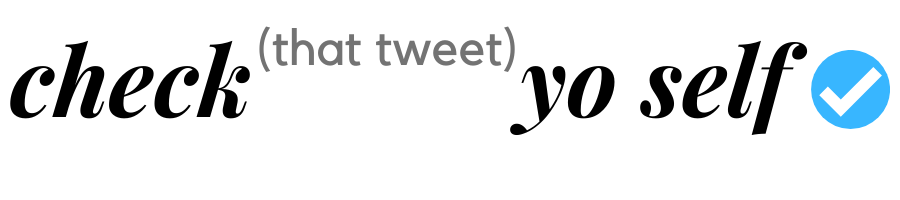
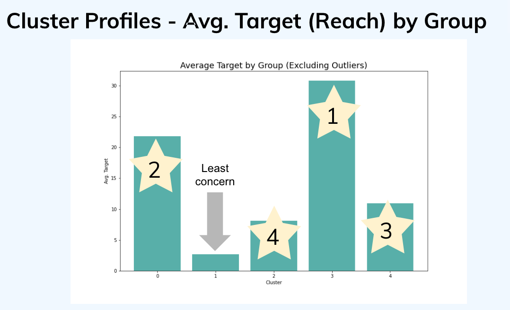
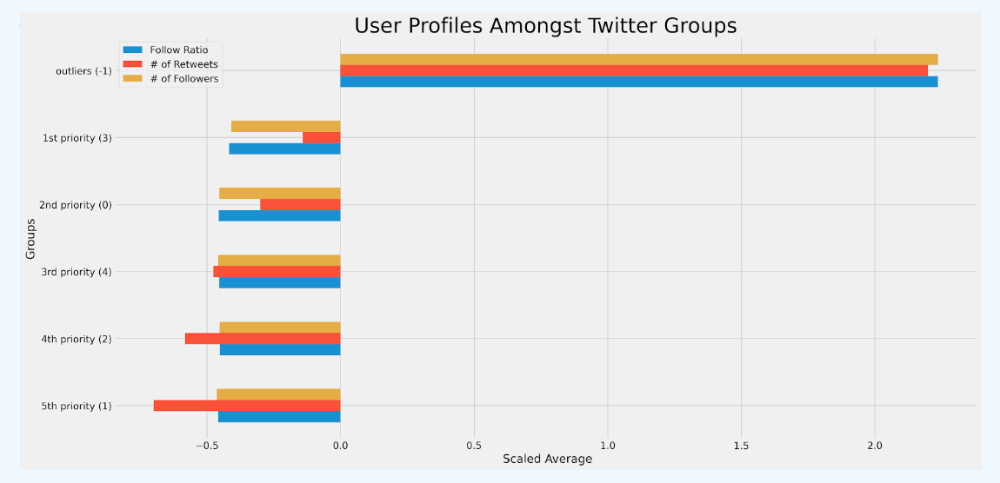

## Prioritizing Fact-Checking During Disasters

### Problem Statement:
During times of crisis, people seek as much information as possible to make the best choices for their safety. A large amount of this information is spread through social media but unfortunately some posts can be misleading or misinterpreted. On rare occasions, users intentionally spread misinformation. Additionally, the volume of posts makes it impossible to thoroughly research everything shared. How can emergency management agencies prioritize which posts to thoroughly fact-check during a disaster?

Our client is an emergency response agency that spends a lot of time and resources to manually verify the information on Twitter, detect inaccuracies and ensure that the correct information, 'good information', reaches the public in a timely manner. 

During a crisis, people are experiencing high levels of stress and they become especially susceptible to misinformation: people may not have enough time to verify or research the information received via social media and people may also feel more responsible to keep others safe by spreading the information they perceive as relevant, however some of that information is likely to be misleading, incomplete, or plain dangerous (just a few examples: incidents with bleach/lysol/disinfectant, methanol, megadoses of vitamin C as cure). Relying on misinformation during disasters can put people in danger [source: Red Cross](https://www.redcross.ca/blog/2017/4/tech-talk-why-misinformation-can-be-dangerous-in-disasters).

For this project, we had the opportunity to speak with experts from FEMA, CEDR, and Florida Search & Rescue. Some of our key takeaways were:
1) There’s no getting around manual fact-checking
2) Time to respond is often limited and it is critical to get the good information out to the public to keep people out of danger
3) Efficiency in allocating resources like volunteers and first responders is very important during crisis

**The goal of this project:** 
(1) Build a framework for analyzing the tweets posted on Twitter, and 
(2) Offer a tool built on that framework to prioritize the tweets that have higher potential for wider reach but would require fact-checking. This would help the emergency agencies to better allocate their precious resources and ultimately help ensure the public gets better information sooner during the times of crisis.

### Data Collection
We have collected tweet and user information via Twitter Scraper, focusing our scrape on the weekend following a coronavirus press hearing held on April 23rd, 2020, where President Trump questioned the possibility of disinfectants being a solution to fighting the virus. Our final dataframe of tweets and user info consists of 33,199 individual tweets. 

*Description of input data sources:*
- Twitter.com 
- Tweets scraped via [Twitter Scraper](https://pypi.org/project/twitter-scraper/)

### Modeling and Evaluation

Since misinformation spreads more than truth, we set out to create a model that predicts the “reach” of a tweet. Tweets with the largest potential audience are the priority for fact-checking. A common issue during disasters is also that everyone is discussing a similar topic, and the NLP alone would not be sufficient to identify the inaccuracy within tweets: the sources become very important. Thus, the Twitter accounts that have a wider reach while potentially not having fully reliable information are the high priority accounts for fact checking by emergency management agencies.

We first tried Supervised Learning with regression models to predict the target:  
Linear regression - Predicted total # of Retweets, Replies, Favorites (Target)
Extra Trees, Bagging Regressor - Too much noise, too many outliers to train an accurate mode

After multiple attempts of testing a variety of regression models, we have concluded that Unsupervised Learning might be more useful. We ended up using a DBSCAN clustering model that produced a strong silhouette score (.76) and also allowed the model to cluster the user information in an unbiased way. It is important to note that the DBSCAN does not require a target variable, nor does it require the k parameter (in contrast to the K-means which requires us to identify the best k number of clusters and input it as a parameter). In addition, we have removed the target variable: target variable = tweet count + favorite counts + reply count - from our DBSCAN model. 

In order to identify the potential for tweet spreadability and focus on the problem of reliability of sources: the DBSCAN model was built solely upon the user info variables: 'user_tweets', 'user_following', 'user_followers', 'ratio', 'has_url', 'has_location', 'has_bio'. Our final groups were 5 clusters of users excluding outliers.

### EDA on Cluster Profiles

Upon our research, we’ve come to the conclusion that the clusters that would be a high priority for fact checking are those that have a wider reach within Twitter and also have a higher likelihood of spreading inaccurate information. 

The prioritization of the clusters:
- 1st priority (Cluster 3)
- 2nd priority (Cluster 0)
- 3rd priority (Cluster 4)
- 4th priority (Cluster 2)
- 5th priority (Cluster 1)
- Outliers (Outlier -1)

**The Cluster 3** has the highest target score among all clusters, which indicates the highest potential for tweets to have a higher reach or get retweeted. The accounts include active users, local public figures, local accounts, reporters.
Interestingly, this is also the only cluster with the positive mean sentiment.

Although the **outliers (group -1)**  has the highest target score, which indicates the highest potential for tweets to be impactful, we decided this would not be a priority. The group -1 is marked by high follower count and contains a lot of users with a large number of followers, public figures, traditional news sources like CNN, WSJ, AP, USAToday etc.
We expect the twitter accounts in this cluster to have a wide reach and a much higher likelihood of their tweets to be retweeted or responded to. The mean retweet_count for this cluster is 27.33 vs the mean of 4.98 for all clusters.

The outlier group is not our high priority for fact checking because this group has a lot of well established accounts that are familiar to the public. Readers digesting the information have likely already formed strong opinions about new sources such as CNN or the Wall Street Journal. These are not the types of sources that volunteers would need to prioritize for fact checking.

### Conclusion and Recommendations:

*Check (That Tweet) Yo Self App:*
To put our model into action, we created an app that goes through the entire process of our project in one click. Users input a keyword, date, and number of tweets to pull. The tweets are then gathered, processed, and classified into the clusters our DBSCAN found. (**Note: Since DBSCAN doesn’t make predictions, the underlying model was K Nearest Neighbors trained on the clusters**). A table of tweets is returned noting which we recommend being the priority for further research. 

See the demo below:

The fight against misinformation is ongoing but with tools to help prioritize tracking sources of misinformation before it spreads, national emergency agencies can make the most out of their manual search efforts. 

Next steps for project improvement: 
- Proceed with additional cluster modeling to strengthen tweet categorization and refine the output 
- Pulling a larger dataset to get a more representative look at the broader conversation
- More interviews with organizations, how can this tool directly address their challenges
- Adding thorough descriptions of the groups to the app webpage
